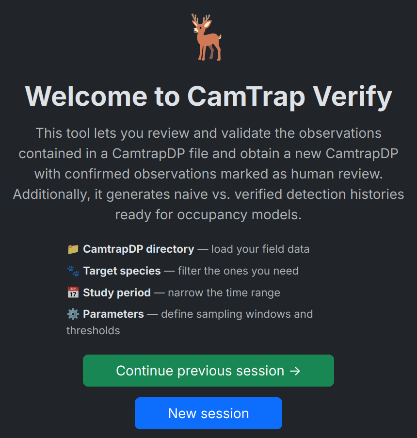

#  CamTrap Verify


[](https://wildintel.eu/)
[](https://fastapi.tiangolo.com/)
[](https://react.dev/)
[](https://github.com/astral-sh/uv)

<hr>

## Web tool for the iterative verification of camera trap classifications

**CamTrap Verify** is an open-source web application designed to help ecologists and wildlife researchers review and validate species detections produced by AI classifiers or citizen-science platforms. It consumes any directory in [CamtrapDP v1.0](https://camtrap-dp.tdwg.org/) format and guides the expert through a structured, iterative review workflow that minimises the total number of images that need to be inspected.

In each round, the tool presents the **highest-confidence sequence** not yet reviewed for every combination of site × sampling period × species. Confirming a sequence closes that cell; rejecting it queues the next-best sequence for the following round. This ensures that expert effort is always directed where it matters most — without having to look at every single image.

Once the review is complete, **CamTrap Verify** exports a verified CamtrapDP package with confirmed observations tagged as human classifications, together with detection histories and camera-operation matrices ready to feed directly into species occupancy models.



## ✨ Features

- Accepts any [CamtrapDP v1.0](https://camtrap-dp.tdwg.org/) directory — output from AI classifiers (e.g. DeepFaune) or citizen-science platforms
- Interactive image gallery with zoom, pan, tonal inversion and full keyboard navigation
- Iterative review by rounds: highest-confidence sequences always shown first
- Exports `camtrap_dp_verified/` with confirmed observations tagged as human classifications
- Generates naive vs. verified detection histories ready for occupancy models (`occupancy_inputs/`)
- Bilingual interface (Spanish / English)
- Docker deployment or hot-reload development mode

## 📋 Requirements

- Python 3.13+ with [uv](https://github.com/astral-sh/uv)
- Node.js 18+ / npm 9+
- Docker + Compose (production only)


## 📚 Documentation

Full documentation available at:
**https://wildintelproject.github.io/wildintel-trap-verify/**

## 🚀 Quick start

```bash
git clone <repo-url>
cd test-fastapi-truetype

# Install dependencies
cd backend && uv sync && cd ..
cd frontend && npm install && cd ..

# Start in development mode
./start.sh dev
```

The browser will open at `http://localhost:5173`. See the [quick start guide](docs/quickstart.md) for a full walkthrough using the included example dataset.

## 🤝 Contributing

Contributions are welcome! Please feel free to submit a Pull Request.

## 📝 License

This project is licensed under the GNU General Public License v3.0 or later - see the [LICENSE](LICENSE) file for details.

This program is free software: you can redistribute it and/or modify it under the terms of the GNU General Public License
as published by the Free Software Foundation, either version 3 of the License, or (at your option) any later version.


## 🏛️ Funding

This work is part of the [WildINTEL project](https://wildintel.eu/), funded by the [Biodiversa+](https://www.biodiversa.eu/) Joint Research Call 2022-2023 "Improved
transnational monitoring of biodiversity and ecosystem change for science and society (BiodivMon)". Biodiversa+ is the
European co-funded biodiversity partnership supporting excellent research on biodiversity with an impact for policy and
society. Biodiversa+ is part of the European Biodiversity Strategy for 2030 that aims to put Europe's biodiversity on a
path to recovery by 2030 and is co-funded by the European Commission.

WildINTEL has been co-funded by the [European Commission](https://commission.europa.eu/) (GA No. 101052342) and the following funding organisations: [Agencia Estatal de Investigación](https://www.aei.gob.es/) (Spain, PCI2023-145963-2, PCI2024-153489), [National Science Centre](https://www.ncn.gov.pl/?language=en) (Poland, UMO-2023/05/Y/NZ8/00104), the [Research Council of Norway](https://www.forskningsradet.no/en/) (Norway, NFR350962) and the [German Research Foundation](https://www.dfg.de/en/) (Germany).