# CamTrap Verify — User Manual

**CamTrap Verify** is a web application that helps ecologists and wildlife researchers review and validate species detections produced by AI classifiers. It accepts data in [CamtrapDP v1.0](https://camtrap-dp.tdwg.org/) format as well as CSV exports from [DeepFaune](https://www.deepfaune.cnrs.fr/) or any other classifier, and guides the expert through a structured, iterative review that minimises the number of images that must be inspected.

---

## Table of Contents

1. [Overview](#1-overview)
2. [Installation](#2-installation)
3. [Getting Started](#3-getting-started)
4. [Welcome Screen](#4-welcome-screen)
5. [Setup Wizard](#5-setup-wizard)
   - [Step 1 — Source](#step-1--source)
     - [Option A — CamtrapDP directory](#option-a--camtrapdp-directory)
     - [Option B — DeepFaune CSV](#option-b--deepfaune-csv)
     - [Option C — Custom CSV](#option-c--custom-csv)
     - [Option D — Trapper instance](#option-d--trapper-instance)
   - [Step 2 — Species](#step-2--species)
   - [Step 3 — Study Period](#step-3--study-period)
   - [Step 4 — Parameters](#step-4--parameters)
6. [Species Index](#6-species-index)
7. [Image Gallery](#7-image-gallery)
   - [Reviewing Sequences](#reviewing-sequences)
   - [Fullscreen Lightbox](#fullscreen-lightbox)
   - [Image Controls](#image-controls)
   - [Keyboard Shortcuts](#keyboard-shortcuts)
   - [Saving Decisions](#saving-decisions)
   - [Completed Species](#completed-species)
8. [Results](#8-results)

---

## 1. Overview

CamTrap Verify helps experts determine whether a species was present at a given location during a study period. To do this, it divides the study period into fixed-length windows called **sampling periods** (e.g. 5-day blocks). Within each sampling period, images from the same camera are grouped into **sequences** — bursts of consecutive frames taken less than N seconds apart. The question the expert answers is therefore always the same: *"Is this species present at this site during this sampling period?"*

To minimise the total number of images that need to be inspected, CamTrap Verify works in **rounds**. In each round, for every combination of site × sampling period × species, the tool presents the **sequence with the highest detection confidence** that has not yet been reviewed.

- **Confirming** a sequence closes that cell — the species is considered present at that site during that period.
- **Rejecting** a sequence queues the next-best sequence for the following round.

This guarantees that expert effort is always directed where it matters most, without reviewing every single image.

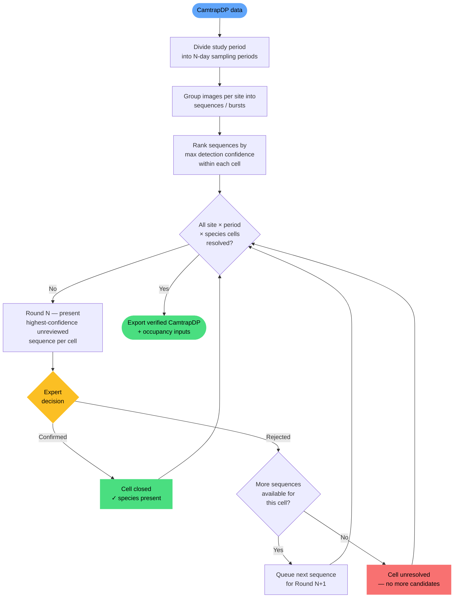

At the end of the review, the tool exports:

- A verified CamtrapDP package (`camtrap_dp_verified/`) with confirmed observations tagged as human classifications.
- Detection histories and camera-operation matrices ready for occupancy models (`occupancy_inputs/`).

---

## 2. Installation

Download the latest release from the [GitHub Releases page](https://github.com/wildintelproject/wildintel-trapverify/releases).

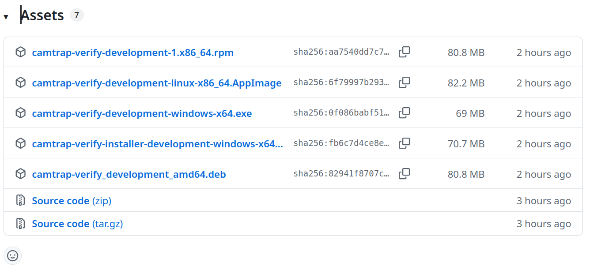
*GitHub Releases page showing the available packages for each platform.*

### Linux

Three options are available depending on your distribution:

**Option 1 — AppImage (any distribution)**

The AppImage is a self-contained executable that runs on any Linux distribution without installation.

```bash
chmod +x camtrap-verify-X.Y.Z-linux-x86_64.AppImage
./camtrap-verify-X.Y.Z-linux-x86_64.AppImage
```

> **Note:** Some distributions require `libfuse2` to run AppImages. Install it with `sudo apt install libfuse2` (Debian/Ubuntu) or `sudo dnf install fuse-libs` (Fedora/RHEL) if you see a FUSE-related error.

**Option 2 — .deb package (Debian / Ubuntu)**

```bash
sudo apt install ./camtrap-verify_X.Y.Z_amd64.deb
camtrap-verify
```

**Option 3 — .rpm package (Fedora / RHEL)**

```bash
sudo dnf localinstall camtrap-verify-X.Y.Z.x86_64.rpm
camtrap-verify
```

### Windows

Two options are available:

- **Portable executable** (`camtrap-verify-X.Y.Z-windows-x64.exe`) — download, double-click and run. No installation required, no administrator rights needed.
- **Installer** (`camtrap-verify-installer-X.Y.Z-windows-x64.exe`) — installs the application with a Start Menu shortcut and an uninstaller entry in *Add or Remove Programs*. Also runs without administrator rights.

Once launched, the application opens automatically in your default browser.

---

## 3. Getting Started

Open your browser and navigate to the application URL (default: `http://localhost:8765` for the desktop app, or the address provided by your administrator).

> **Tip:** The application works entirely in your browser. Your data never leaves your machine.

---

## 4. Welcome Screen

When you open the application for the first time, or when no session is active, you will see the **Welcome Screen**.


*The Welcome Screen, showing the three session buttons.*

Three buttons are available:

| Button | Description |
|---|---|
| **Continue previous session →** | Resumes the last session you worked on. Shows a summary (species count, progress %). |
| **Open a specific session…** | Opens a file browser so you can load any existing session folder. |
| **New session** | Starts the Setup Wizard to configure a brand-new session. |

> If a previous session exists, **Continue previous session** displays a progress summary below the button (e.g. *3 species · 12/40 periods reviewed · 30%*).

---

## 5. Setup Wizard

The Setup Wizard guides you through four steps. A step indicator at the top shows your progress.

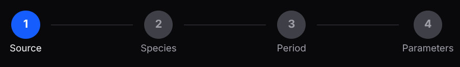
*Step indicator showing the four stages: Source · Species · Period · Parameters.*

You can navigate between steps using the **← Back** and **Next →** buttons, or return to the Welcome Screen with **← Welcome**.

### Step 1 — Source

First choose where your data comes from: **Local filesystem** or a **Trapper instance**.

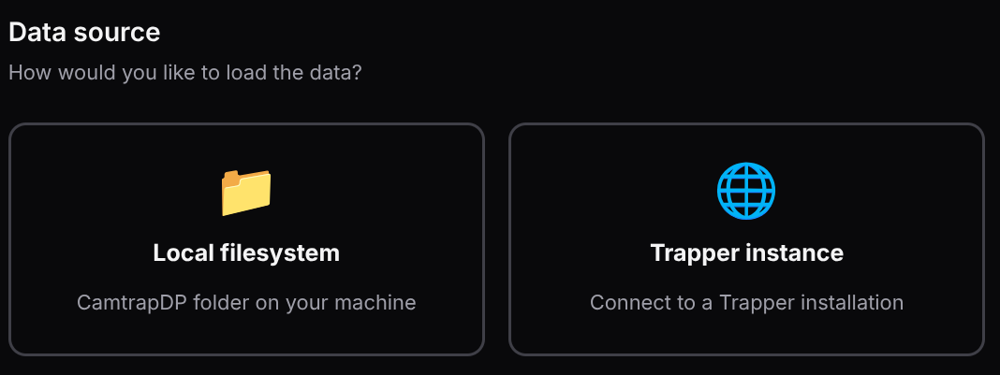
*Data source selector.*

If you select **Local filesystem**, a second selector appears asking for the **data format**. Three formats are supported:

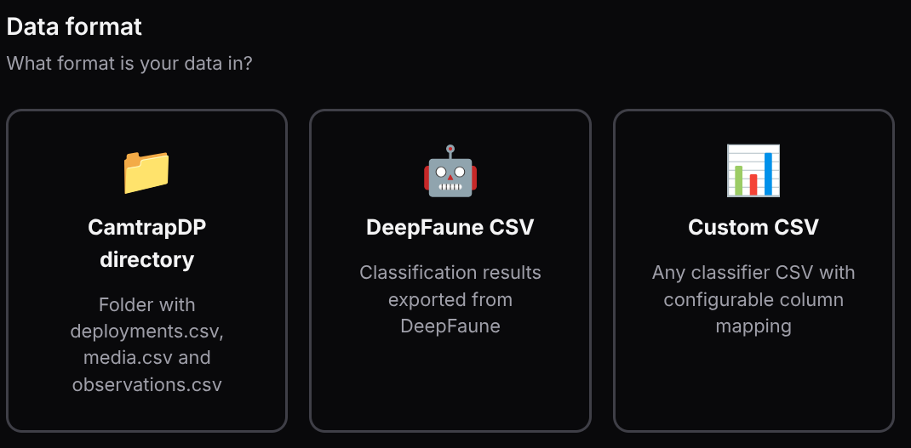
*Format selector: CamtrapDP directory, DeepFaune CSV or Custom CSV.*

#### Option A — CamtrapDP directory

Select the folder on your machine that contains the CamtrapDP files (`deployments.csv`, `media.csv`, `observations.csv`).


*Local directory selection. The Browse button opens a folder picker.*

- **Data directory** — path to your CamtrapDP folder. Use the **📁 Browse** button or type the path manually.
- **Images directory** *(optional)* — base directory used to resolve relative `filePath` values in `media.csv`. Leave empty to use the parent of the data directory (default behaviour).

After selecting the folder, the application reads species and date ranges automatically. Click **Next →** to proceed.

> **Image paths:** three formats are supported in the `filePath` column of `media.csv`:
> - **Relative paths** — resolved relative to the **Images directory** if provided, otherwise relative to the parent of the CamtrapDP directory.
> - **Absolute paths** — used as-is.
> - **HTTP/HTTPS URLs** — fetched through the application's built-in proxy, so no CORS configuration is needed.

#### Option B — DeepFaune CSV

If your data comes from [DeepFaune](https://www.deepfaune.cnrs.fr/), select the **DeepFaune CSV** format. The application converts the file to CamtrapDP format automatically.

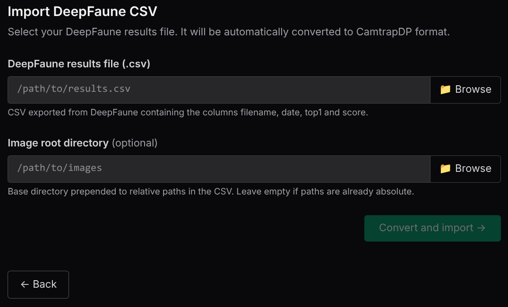
*DeepFaune import form.*

- **DeepFaune results file** — path to the `.csv` exported from DeepFaune.
- **Image root directory** *(optional)* — base directory to resolve relative image paths. Leave empty if paths in the CSV are already absolute.

Click **Convert and import →**. Once the conversion is complete, the wizard advances automatically to Step 2.

#### Option C — Custom CSV

For any other classifier that exports a CSV, choose the **Custom CSV** format. You map the columns of your file to the fields required by CamtrapDP.

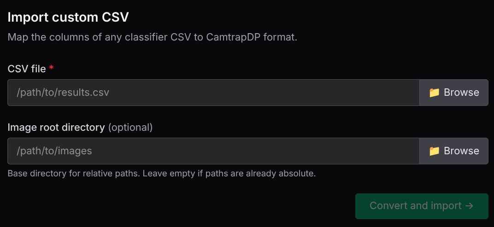
*Custom CSV import form.*

**Column mapping**

Once the CSV file is selected, the application reads its headers and displays a mapping form where you link each column in your file to the fields required by CamtrapDP.

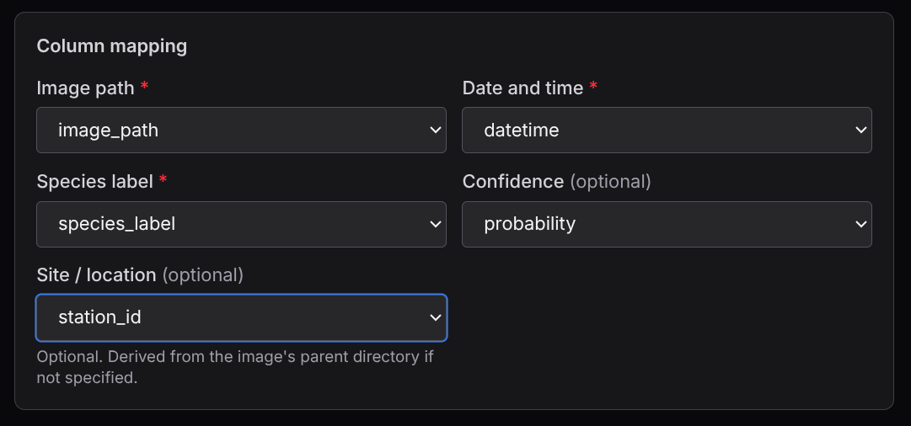
*Column mapping form. Each dropdown is populated with the column names detected in your CSV.*

Select which column in your CSV corresponds to each required field:

| Field | Required | Description |
|---|---|---|
| **Image path** | Yes | Column containing the file path or name of each image. |
| **Date and time** | Yes | Column containing the capture timestamp. |
| **Species label** | Yes | Column containing the classifier's species label. |
| **Confidence** | No | Column containing the detection score (0–1). |
| **Site / location** | No | Column identifying the camera site. Derived from the image path if omitted. |

As soon as you select the **Species label** column, the application reads all unique labels and displays the **Species map** table.

**Species map**

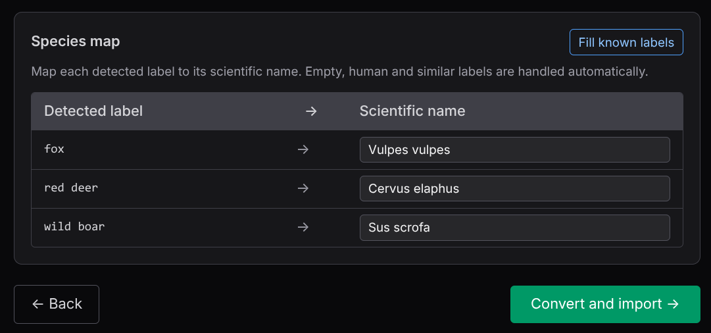
*Species map table. Each detected label must be mapped to a scientific name.*

For each label in your CSV, enter the corresponding scientific name (e.g. `Vulpes vulpes`). Labels that match known DeepFaune classes are pre-filled automatically. Non-animal labels (`empty`, `blank`, `human`, etc.) are handled automatically and do not appear in the table.

Use **Fill known labels** to auto-fill any remaining entries that match the built-in label dictionary.

Click **Convert and import →** to convert and proceed.

#### Option D — Trapper instance

Connect to a [Trapper](https://trapper-project.readthedocs.io/) installation to download a CamtrapDP package directly from the platform.


*Trapper connection form.*

1. Enter the **Trapper URL**, **username** and **password**, then click **Test connection**.
2. Once connected, select the **Research project** and the **Classification project**.
3. Click **Generate CamtrapDP** — the package is downloaded and loaded automatically.

> **Note:** Trapper integration is currently under active development. Some features may not yet be available.

### Step 2 — Species

Choose which species you want to verify. The list is populated from the `scientificName` column in `observations.csv`.


*Species selection step. Check the species you want to review.*

- Use **Select all** / **Deselect all** for bulk actions.
- The counter at the bottom shows how many species are currently selected.

### Step 3 — Study Period

Set the date range for the review. Only images whose timestamp falls within this range will be included.

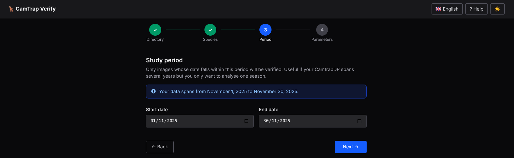
*Study period step. The data range hint shows the earliest and latest dates in your dataset.*

- An info hint shows the full date span available in your data.
- Useful when your CamtrapDP spans multiple years but you only want to analyse one season.

### Step 4 — Parameters

Fine-tune how images are grouped and how confirmations are recorded. Parameters are divided into two sections.

#### Sampling parameters

These control how the data is segmented into reviewable units.

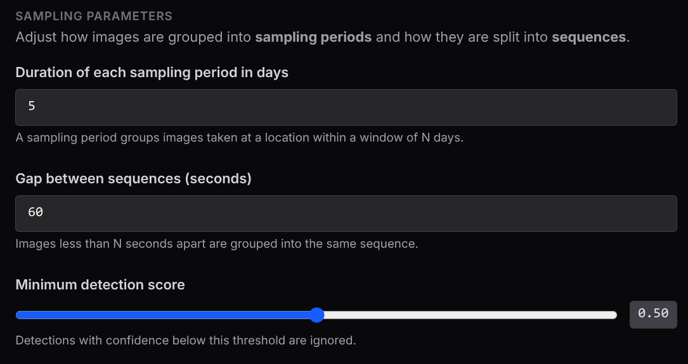
*Sampling parameters section.*

| Parameter | Default | Description |
|---|---|---|
| **Sampling period duration (days)** | 5 | Groups images at a location into windows of N days. The number of periods adapts automatically to the study duration. |
| **Gap between sequences (seconds)** | 60 | Images less than N seconds apart at the same site belong to the same sequence. |
| **Minimum detection score** | 0.5 | Detections below this confidence threshold are excluded from the candidate set. |

#### Confirmation parameters

These control what is recorded in the output when an expert confirms a sequence.

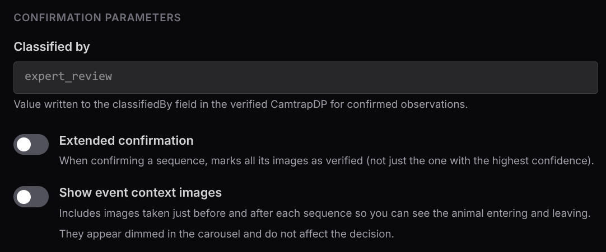
*Confirmation parameters section.*

| Parameter | Default | Description |
|---|---|---|
| **Classified by** | `expert_review` | Value written to the `classifiedBy` field in the verified CamtrapDP for every confirmed observation. Change this to identify the reviewer (e.g. `ornithologist_A`). |
| **Extended confirmation** | Off | When enabled, all observations in the confirmed burst — not just the highest-confidence frame — are marked as human-verified in the output. |
| **Show all event frames** | Off | When enabled, all frames from the same deployment captured between the first and last detection of the target species are shown in the carousel, even if they are not labelled as that species. This lets you see the full context of the animal's visit. Context frames appear dimmed and do not affect the decision. |

Click **✓ Start verification** to process the data and begin the review.

---

## 6. Species Index

After setup (or when resuming a session), you arrive at the **Species Index** — an overview of all target species and their review progress.


*Species index showing species cards with progress bars.*

An information panel at the top shows the session parameters:

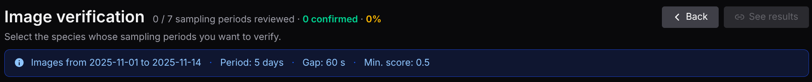
*Info panel showing date range, sampling period, gap and minimum score.*

Each **species card** displays:

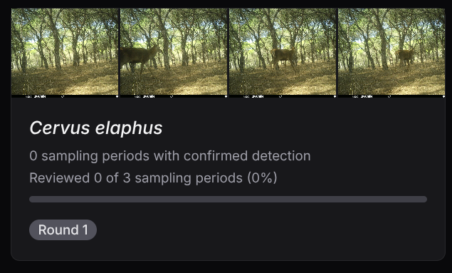
*A species card showing thumbnail strip, progress bar and round badge.*

- A thumbnail strip with representative images.
- The number of sampling periods with confirmed detections.
- A progress bar and percentage of reviewed periods.
- A badge: **Complete** (green) or **Round N** (grey) indicating the current review round.

Click any card to open the Image Gallery for that species.

The header shows overall progress and two action buttons:

- **← Back** — return to the Welcome Screen.
- **See results** — navigate to the Results page (only active when all species are complete).

---

## 7. Image Gallery

The Image Gallery is the main review screen. It shows all sampling periods for a single species, grouped by location.


*Gallery showing sampling period cards grouped by site.*

The header shows:
- The species name and current round badge.
- Overall progress (periods reviewed / total).
- A **← Back** button to return to the Species Index.

A blue info box below the header explains the round logic:

> *In round N, each sampling period is represented by the sequence with the highest detection confidence among those not yet reviewed.*

### Reviewing Sequences

Each **sampling period card** shows:

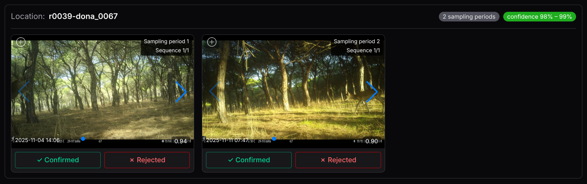
*A sampling period card with image carousel and decision buttons.*

- Location and period number.
- Confidence range of the sequences in this period.
- A carousel of the images in the current sequence, with left/right arrows to browse frames.
- Two decision buttons: **✓ Confirmed** and **✗ Rejected**.

If **Show all event frames** is enabled, all frames from the same deployment captured between the first and last detection of the target species are shown in the carousel, including those not labelled as that species. These frames appear dimmed and do not affect the decision.

Click any image to open the [Fullscreen Lightbox](#fullscreen-lightbox).

### Fullscreen Lightbox

Click any image thumbnail to open the lightbox for a closer look.

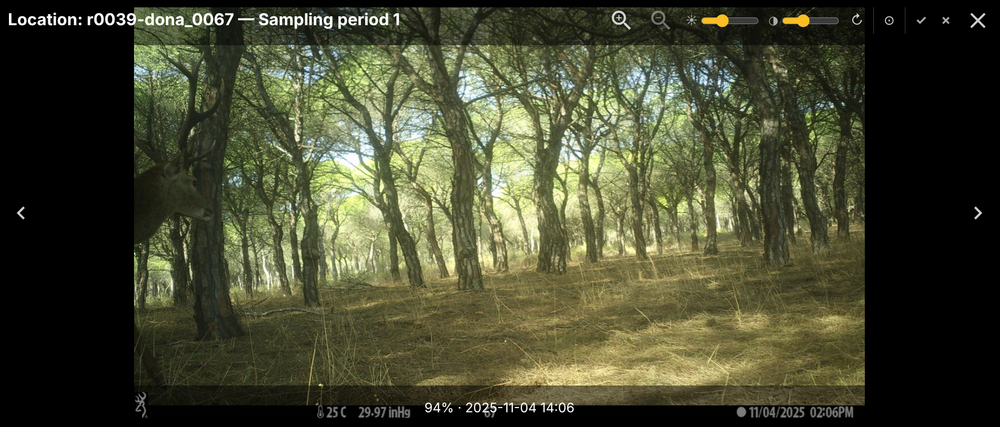
*Fullscreen lightbox with image controls and decision buttons.*

The lightbox shows:
- The full-size image with zoom and pan support.
- Navigation arrows to browse frames within the sequence.
- The location and sampling period in the title bar.
- Decision buttons and image adjustment controls in the toolbar.

### Image Controls

The lightbox toolbar provides several controls to improve image visibility:

| Control | Description |
|---|---|
| ☀ **Brightness** | Slider to increase or decrease brightness (50 – 200 %). |
| ◑ **Contrast** | Slider to increase or decrease contrast (50 – 200 %). |
| ↻ **Rotate 90°** | Rotate the image clockwise in 90° steps. |
| ⊘ **Reset image** | Restore brightness, contrast and rotation to defaults. |
| **Invert colours** | Toggle colour inversion — useful for night-vision images. |

All adjustments reset automatically when you move to a different sequence or close the lightbox.

### Keyboard Shortcuts

While the lightbox is open:

| Key | Action |
|---|---|
| `Y` | Confirm the current sequence |
| `N` | Reject the current sequence |
| `←` `→` | Navigate between frames in the sequence |

After a decision, the lightbox automatically advances to the next undecided sequence.

### Saving Decisions

Once you have reviewed the sequences, click **💾 Save decisions** (floating button, bottom-right).


*Floating action buttons: Confirm all, Save decisions.*

- If all sequences have been decided, the session advances to the next round (if any periods were rejected) or marks the species as **Complete**.
- If some sequences are still undecided, a warning is shown.

The **✓✓ Confirm all** button marks every undecided sequence in the current view as confirmed in one click.

### Completed Species

When all periods for a species have been decided, the gallery shows a **Complete** badge and locks the view.


*Completed species with the lock icon and edit mode toggle.*

- Click 🔓 to enter **edit mode** and correct any decisions.
- In edit mode, click **Update decisions** to save and regenerate the results.
- Click 🔒 to lock the view again.

---

## 8. Results

Once all species are complete, the **See results** button in the Species Index header becomes active.


*The "See results" button turns green when all species have been reviewed.*

Click it to open the **Results** page, which summarises the entire review.


*Results page showing overall counts and per-species breakdown.*

The page shows:

- **Output directory** — path to the generated files, with a copy button and a shortcut to open the folder.
- **By sampling period** — confirmed / rejected / unreviewed counts with percentages.
- **By sequence** — the same breakdown at sequence level.
- A **per-species table** with detailed counts.

A **← Back** button in the header returns to the Species Index.

### Output Files

Each session is saved in a timestamped subfolder inside the output directory (e.g. `~/Documents/camtrap_verify/20260629_143021/`). The folder contains:

**Session files (root)**

| File | Description |
|---|---|
| `config.json` | Session configuration: data directory, date range, parameters. |
| `candidate_manifest.csv` | Full list of candidate sequences generated at setup. |
| `rejected_media.json` | IDs of media files rejected during the review. |
| `decisions/` | Per-species per-round decision CSVs, named `decisions_{species}_iter{N}.csv` (e.g. `decisions_Vulpes_vulpes_iter1.csv`). |

**`camtrap_dp_verified/`** — verified CamtrapDP package

| File | Description |
|---|---|
| `deployments.csv` | Original deployment table (unchanged). |
| `media.csv` | Original media table (unchanged). |
| `observations.csv` | Confirmed observations updated with `classificationMethod='human'`, `classificationProbability=1.0`, `classifiedBy=<configured value>` and `classificationTimestamp`. |

**`occupancy_inputs/`** — ready-to-use files for occupancy models

| File | Description |
|---|---|
| `camera_operation.csv` | Camera operation matrix (sites × sampling periods). |
| `dethist_naive_{sp}.csv` | Naive detection history per species (AI detections, not human-validated). One file per species. |
| `dethist_verified_{sp}.csv` | Verified detection history per species (confirmed by expert). One file per species. |
| `verification_summary.csv` | Per-species summary: confirmed, rejected and unreviewed counts. |
| `review_effort.csv` | Total review effort: number of sequences and images inspected. |
