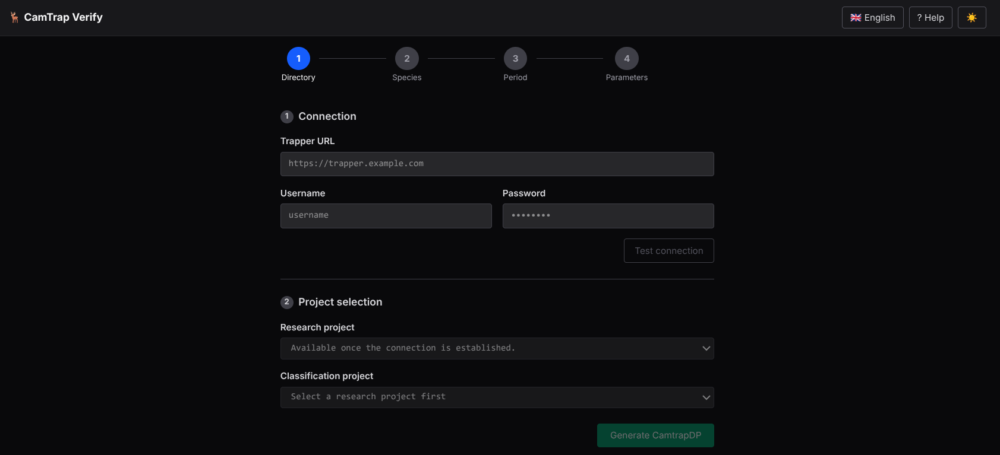
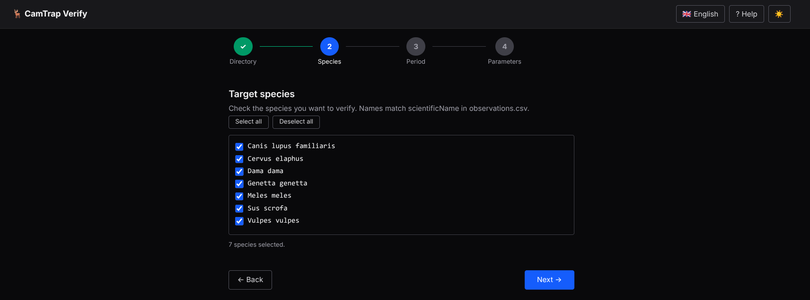
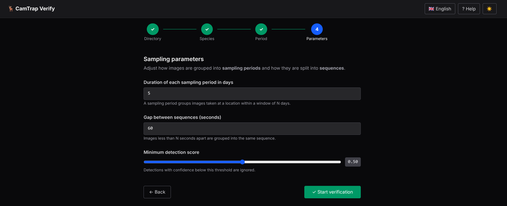
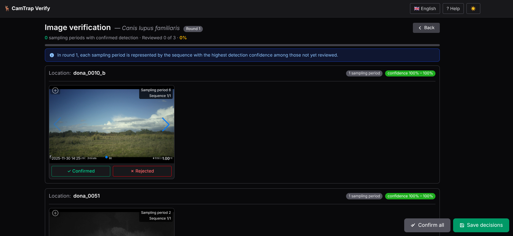
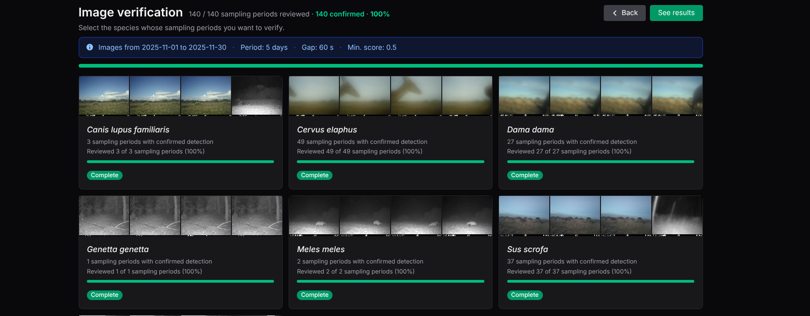

# CamTrap Verify — User Manual

**CamTrap Verify** is a web application that helps ecologists and wildlife researchers review and validate species detections produced by AI classifiers. It reads any [CamtrapDP v1.0](https://camtrap-dp.tdwg.org/) directory and guides the expert through a structured, iterative review that minimises the number of images that must be inspected.

---

## Table of Contents

1. [Overview](#1-overview)
2. [Installation](#2-installation)
3. [Getting Started](#3-getting-started)
4. [Welcome Screen](#4-welcome-screen)
5. [Setup Wizard](#5-setup-wizard)
   - [Step 1 — Source](#step-1--source)
   - [Step 2 — Species](#step-2--species)
   - [Step 3 — Study Period](#step-3--study-period)
   - [Step 4 — Parameters](#step-4--parameters)
6. [Species Index](#6-species-index)
7. [Image Gallery](#7-image-gallery)
   - [Reviewing Sequences](#reviewing-sequences)
   - [Fullscreen Lightbox](#fullscreen-lightbox)
   - [Image Controls](#image-controls)
   - [Keyboard Shortcuts](#keyboard-shortcuts)
   - [Saving Decisions](#saving-decisions)
   - [Completed Species](#completed-species)
8. [Results](#8-results)

---

## 1. Overview

CamTrap Verify works in **rounds**. In each round, for every combination of site × sampling period × species, the tool presents the **sequence with the highest detection confidence** that has not yet been reviewed.

- **Confirming** a sequence closes that cell — the species is considered present at that site during that period.
- **Rejecting** a sequence queues the next-best sequence for the following round.

This guarantees that expert effort is always directed where it matters most, without reviewing every single image.

At the end of the review, the tool exports:

- A verified CamtrapDP package (`camtrap_dp_verified/`) with confirmed observations tagged as human classifications.
- Detection histories and camera-operation matrices ready for occupancy models (`occupancy_inputs/`).

---

## 2. Installation

Download the latest release from the [GitHub Releases page](https://github.com/wildintelproject/wildintel-trapverify/releases).

### Linux

Download the `.deb` (Debian/Ubuntu) or `.rpm` (Fedora/RHEL) package and install it with your package manager:

```bash
# Debian / Ubuntu
sudo apt install ./camtrap-verify_X.Y.Z_amd64.deb

# Fedora / RHEL
sudo dnf localinstall camtrap-verify-X.Y.Z.x86_64.rpm
```

Then launch the application from the terminal:

```bash
camtrap-verify
```

### Windows

Two options are available:

- **Portable executable** (`camtrap-verify-X.Y.Z-windows-x64.exe`) — download, double-click and run. No installation required, no administrator rights needed.
- **Installer** (`camtrap-verify-installer-X.Y.Z-windows-x64.exe`) — installs the application with a Start Menu shortcut and an uninstaller entry in *Add or Remove Programs*. Also runs without administrator rights.

Once launched, the application opens automatically in your default browser.

---

## 3. Getting Started


Open your browser and navigate to the application URL (default: `http://localhost:8765` for the desktop app, or the address provided by your administrator).

> **Tip:** The application works entirely in your browser. Your data never leaves your machine.

---

## 4. Welcome Screen

When you open the application for the first time, or when no session is active, you will see the **Welcome Screen**.


*The Welcome Screen, showing the three session buttons.*

Three buttons are available:

| Button | Description |
|---|---|
| **Continue previous session →** | Resumes the last session you worked on. Shows a summary (species count, progress %). |
| **Open a specific session…** | Opens a file browser so you can load any existing session folder. |
| **New session** | Starts the Setup Wizard to configure a brand-new session. |

> If a previous session exists, **Continue previous session** displays a progress summary below the button (e.g. *3 species · 12/40 periods reviewed · 30%*).

---

## 5. Setup Wizard

The Setup Wizard guides you through four steps. A step indicator at the top shows your progress.


*Step indicator showing the four stages: Directory · Species · Period · Parameters.*

You can navigate between steps using the **← Back** and **Next →** buttons, or return to the Welcome Screen with **← Welcome**.

### Step 1 — Source

First choose where your CamtrapDP data comes from:


*Data source selector: local filesystem or Trapper instance.*

**Option A — Local filesystem**

Select the folder on your machine that contains the CamtrapDP files (`deployments.csv`, `media.csv`, `observations.csv`).


*Local directory selection. The Browse button opens a folder picker.*

- **Data directory** — path to your CamtrapDP folder. Use the **📁 Browse** button or type the path manually.
- **Output directory** *(optional)* — where results will be saved. Defaults to `~/Documents/camtrap_verify`. Each run creates a timestamped subfolder.

After selecting the folder, the application reads species and date ranges automatically.

**Option B — Trapper instance**

Connect to a [Trapper](https://trapper-project.readthedocs.io/) installation to download a CamtrapDP package directly from the platform.


*Trapper connection form.*

1. Enter the **Trapper URL**, **username** and **password**, then click **Test connection**.
2. Once connected, select the **Research project** and the **Classification project**.
3. Click **Generate CamtrapDP** — the package is downloaded and loaded automatically.

> **Note:** Trapper integration is currently under active development. Some features may not yet be available.

### Step 2 — Species

Choose which species you want to verify. The list is populated from the `scientificName` column in `observations.csv`.


*Species selection step. Check the species you want to review.*

- Use **Select all** / **Deselect all** for bulk actions.
- The counter at the bottom shows how many species are currently selected.

### Step 3 — Study Period

Set the date range for the review. Only images whose timestamp falls within this range will be included.


*Study period step. The data range hint shows the earliest and latest dates in your dataset.*

- An info hint shows the full date span available in your data.
- Useful when your CamtrapDP spans multiple years but you only want to analyse one season.

### Step 4 — Parameters

Fine-tune how images are grouped into sampling periods and sequences.


*Sampling parameters step.*

| Parameter | Default | Description |
|---|---|---|
| **Sampling period duration (days)** | 7 | Groups images at a location into windows of N days. |
| **Gap between sequences (seconds)** | 60 | Images less than N seconds apart belong to the same sequence. |
| **Minimum detection score** | 0.6 | Detections below this confidence threshold are ignored. |

Click **✓ Start verification** to process the data and begin the review.

---

## 6. Species Index

After setup (or when resuming a session), you arrive at the **Species Index** — an overview of all target species and their review progress.


*Species index showing species cards with progress bars.*

An information panel at the top shows the session parameters:


*Info panel showing date range, sampling period, gap and minimum score.*

Each **species card** displays:

- A thumbnail strip with representative images.
- The number of sampling periods with confirmed detections.
- A progress bar and percentage of reviewed periods.
- A badge: **Complete** (green) or **Round N** (grey) indicating the current review round.

Click any card to open the Image Gallery for that species.

The header shows overall progress and two action buttons:

- **← Back** — return to the Welcome Screen.
- **See results** — navigate to the Results page (only active when all species are complete).

---

## 7. Image Gallery

The Image Gallery is the main review screen. It shows all sampling periods for a single species, grouped by location.


*Gallery showing sampling period cards grouped by site.*

The header shows:
- The species name and current round badge.
- Overall progress (periods reviewed / total).
- A **← Back** button to return to the Species Index.

A blue info box below the header explains the round logic:

> *In round N, each sampling period is represented by the sequence with the highest detection confidence among those not yet reviewed.*

### Reviewing Sequences

Each **sampling period card** shows:


*A sampling period card with image thumbnails and decision buttons.*

- Location and period number.
- Confidence range of the sequences in this period.
- A thumbnail strip of the images in the current sequence.
- Two decision buttons: **✓ Confirmed** and **✗ Rejected**.

Click a thumbnail to open the [Fullscreen Lightbox](#fullscreen-lightbox).

### Fullscreen Lightbox

Click any image thumbnail to open the lightbox for a closer look.


*Fullscreen lightbox with image controls and decision buttons.*

The lightbox shows:
- The full-size image with zoom and pan support.
- Navigation arrows to browse frames within the sequence.
- The location and sampling period in the title bar.
- Decision buttons and image adjustment controls in the toolbar.

### Image Controls

The lightbox toolbar provides several controls to improve image visibility:


*Image adjustment controls in the lightbox toolbar.*

| Control | Description |
|---|---|
| ☀ **Brightness** | Slider to increase or decrease brightness (50 – 200 %). |
| ◑ **Contrast** | Slider to increase or decrease contrast (50 – 200 %). |
| ↻ **Rotate 90°** | Rotate the image clockwise in 90° steps. |
| ⊘ **Reset image** | Restore brightness, contrast and rotation to defaults. |
| **Invert colours** | Toggle colour inversion — useful for night-vision images. |

All adjustments reset automatically when you move to a different sequence or close the lightbox.

### Keyboard Shortcuts

While the lightbox is open:

| Key | Action |
|---|---|
| `Y` | Confirm the current sequence |
| `N` | Reject the current sequence |
| `←` `→` | Navigate between frames in the sequence |

After a decision, the lightbox automatically advances to the next undecided sequence.

### Saving Decisions

Once you have reviewed the sequences, click **💾 Save decisions** (floating button, bottom-right).


*Floating action buttons: Confirm all, Save decisions.*

- If all sequences have been decided, the session advances to the next round (if any periods were rejected) or marks the species as **Complete**.
- If some sequences are still undecided, a warning is shown.

The **✓✓ Confirm all** button marks every undecided sequence in the current view as confirmed in one click.

### Completed Species

When all periods for a species have been decided, the gallery shows a **Complete** badge and locks the view.


*Completed species with the lock icon and edit mode toggle.*

- Click 🔓 to enter **edit mode** and correct any decisions.
- In edit mode, click **Update decisions** to save and regenerate the results.
- Click 🔒 to lock the view again.

---

## 8. Results

Once all species are complete, the **See results** button in the Species Index header becomes active.


*The "See results" button turns green when all species have been reviewed.*

Click it to open the **Results** page, which summarises the entire review.


*Results page showing overall counts and per-species breakdown.*

The page shows:

- **Output directory** — path to the generated files, with a copy button and a shortcut to open the folder.
- **By sampling period** — confirmed / rejected / unreviewed counts with percentages.
- **By sequence** — the same breakdown at sequence level.
- A **per-species table** with detailed counts.

A **← Back** button in the header returns to the Species Index.

### Output Files

Each session is saved in a timestamped subfolder inside the output directory (e.g. `~/Documents/camtrap_verify/20260629_143021/`). The folder contains:

**Session files (root)**

| File | Description |
|---|---|
| `config.json` | Session configuration: data directory, date range, parameters. |
| `candidate_manifest.csv` | Full list of candidate sequences generated at setup. |
| `rejected_media.json` | IDs of media files rejected during the review. |
| `decisions/` | Per-species decision CSVs, one file per review round (`iter1.csv`, `iter2.csv`, …). |

**`camtrap_dp_verified/`** — verified CamtrapDP package

| File | Description |
|---|---|
| `deployments.csv` | Original deployment table (unchanged). |
| `media.csv` | Original media table (unchanged). |
| `observations.csv` | Confirmed observations, tagged with `classificationMethod='human'`, `classificationProbability=1.0` and `classifiedBy='expert_review'`. |

**`occupancy_inputs/`** — ready-to-use files for occupancy models

| File | Description |
|---|---|
| `camera_operation.csv` | Camera operation matrix (sites × sampling periods). |
| `dethist_naive_<species>.csv` | Naive detection history per species (AI detections, not human-validated). One file per species. |
| `dethist_verified_<species>.csv` | Verified detection history per species (confirmed by expert). One file per species. |
| `verification_summary.csv` | Per-species summary: confirmed, rejected and unreviewed counts. |
| `review_effort.csv` | Total review effort: number of sequences and images inspected. |
