# CamTrap Verify — User Manual

**CamTrap Verify** is a web application that helps ecologists and wildlife researchers review and validate species detections produced by AI classifiers. It accepts data in [CamtrapDP v1.0](https://camtrap-dp.tdwg.org/) format as well as CSV exports from [DeepFaune](https://www.deepfaune.cnrs.fr/) or any other classifier, and guides the expert through a structured, iterative review that minimises the number of images that must be inspected.

---

## Table of Contents

1. [Overview](#1-overview)
2. [Installation](#2-installation)
3. [Getting Started](#3-getting-started)
4. [Welcome Screen](#4-welcome-screen)
5. [Setup Wizard](#5-setup-wizard)
   - [Step 1 — Source](#step-1--source)
     - [Option A — CamtrapDP directory](#option-a--camtrapdp-directory)
     - [Option B — DeepFaune CSV](#option-b--deepfaune-csv)
     - [Option C — Custom CSV](#option-c--custom-csv)
     - [Option D — Trapper instance](#option-d--trapper-instance)
   - [Step 2 — Species](#step-2--species)
   - [Step 3 — Study Period](#step-3--study-period)
   - [Step 4 — Parameters](#step-4--parameters)
6. [Species Index](#6-species-index)
7. [Image Gallery](#7-image-gallery)
   - [Reviewing Detection Events](#reviewing-detection-events)
   - [Fullscreen Lightbox](#fullscreen-lightbox)
   - [Image Controls](#image-controls)
   - [Keyboard Shortcuts](#keyboard-shortcuts)
   - [Saving Decisions](#saving-decisions)
   - [Completed Species](#completed-species)
8. [Results](#8-results)

---

## 1. Overview

CamTrap Verify helps experts determine whether a species was present at a given location during a study period. To do this, it divides the study period into fixed-length windows called **sampling occasions** (e.g. 5-day blocks). Within each sampling occasion, images from the same camera are grouped into **detection events** — bursts of consecutive frames taken less than N seconds apart. The question the expert answers is therefore always the same: *"Is this species present at this site during this sampling occasion?"*

To minimise the total number of images that need to be inspected, CamTrap Verify works in **rounds**. In each round, for every combination of site × sampling occasion × species, the tool presents the **detection event with the highest detection confidence** that has not yet been reviewed. The expert then decides:

- **Confirming** a detection event closes that cell — the species is considered present at that site during that occasion.
- **Rejecting** a detection event queues the next-best detection event for the following round.

This guarantees that expert effort is always directed where it matters most, without reviewing every single image. The diagram below summarises the process the expert follows:

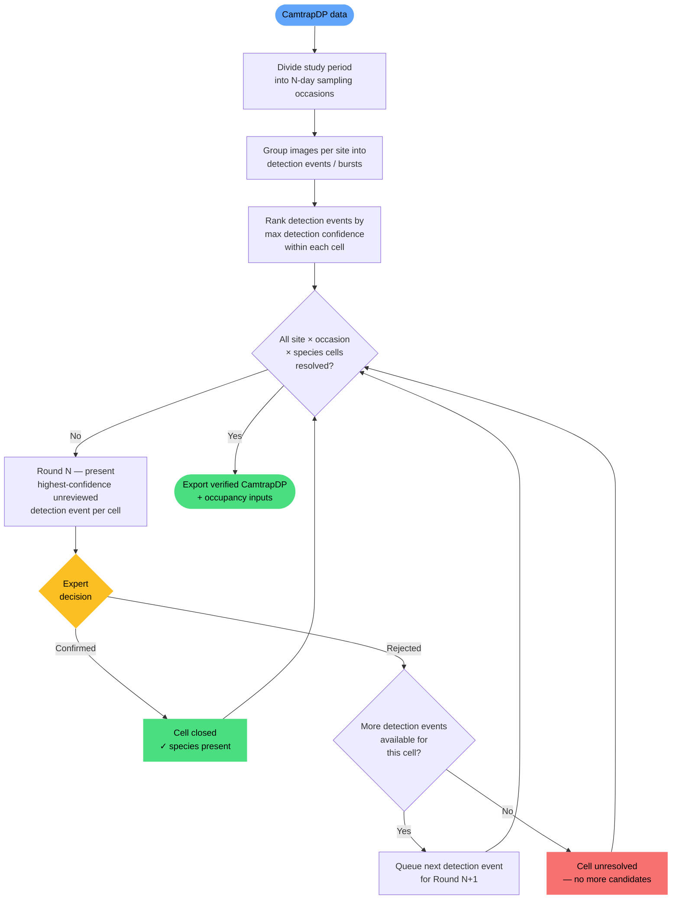
```mermaid
flowchart TD
    A([CamtrapDP data]) --> B[Divide study period\ninto N-day sampling occasions]
    B --> C[Group images per site into\ndetection events / bursts]
    C --> D[Rank detection events by\nmax detection confidence\nwithin each cell]

    D --> E{All site × occasion\n× species cells\nresolved?}

    E -- No --> F[Round N — present\nhighest-confidence unreviewed\ndetection event per cell]
    F --> G{Expert\ndecision}

    G -- Confirmed --> H[Cell closed\n✓ species present]
    G -- Rejected --> I{More detection events\navailable for\nthis cell?}

    I -- Yes --> J[Queue next detection event\nfor Round N+1]
    I -- No --> K[Cell unresolved\n— no more candidates]

    H --> E
    J --> E
    K --> E

    E -- Yes --> L([Export verified CamtrapDP\n+ occupancy inputs])

    style A fill:#60a5fa,color:#000,stroke:none
    style L fill:#4ade80,color:#000,stroke:none
    style H fill:#4ade80,color:#000,stroke:none
    style K fill:#f87171,color:#000,stroke:none
    style G fill:#fbbf24,color:#000,stroke:none
```

At the end of the review, the tool exports:

- A verified CamtrapDP package (`camtrap_dp_verified/`) with confirmed observations tagged as human classifications.
- Detection histories and camera-operation matrices ready for occupancy models (`occupancy_inputs/`).

---

## 2. Installation

Download the latest release from the [GitHub Releases page](https://github.com/wildintelproject/wildintel-trapverify/releases).

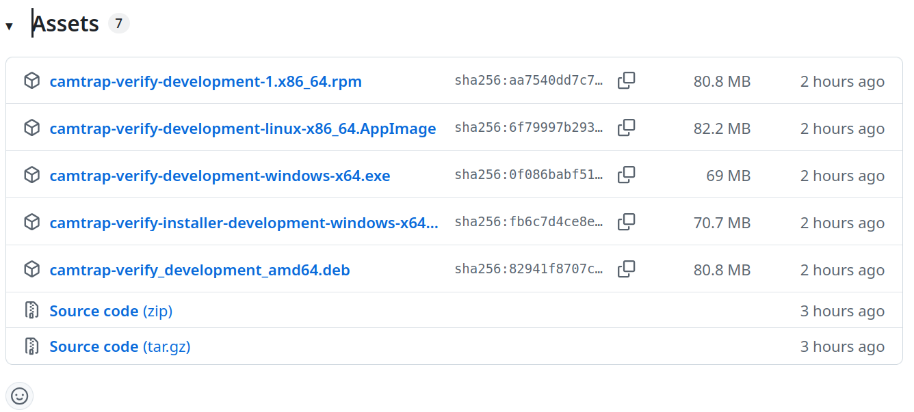
*GitHub Releases page showing the available packages for each platform.*

### Linux

Three options are available depending on your distribution:

**Option 1 — AppImage (any distribution)**

The AppImage is a self-contained executable that runs on any Linux distribution without installation.

```bash
chmod +x camtrap-verify-X.Y.Z-linux-x86_64.AppImage
./camtrap-verify-X.Y.Z-linux-x86_64.AppImage
```

> **Note:** Some distributions require `libfuse2` to run AppImages. Install it with `sudo apt install libfuse2` (Debian/Ubuntu) or `sudo dnf install fuse-libs` (Fedora/RHEL) if you see a FUSE-related error.

**Option 2 — .deb package (Debian / Ubuntu)**

```bash
sudo apt install ./camtrap-verify_X.Y.Z_amd64.deb
camtrap-verify
```

**Option 3 — .rpm package (Fedora / RHEL)**

```bash
sudo dnf localinstall camtrap-verify-X.Y.Z.x86_64.rpm
camtrap-verify
```

### Windows

Two options are available:

- **Portable executable** (`camtrap-verify-X.Y.Z-windows-x64.exe`) — download, double-click and run. No installation required, no administrator rights needed.
- **Installer** (`camtrap-verify-installer-X.Y.Z-windows-x64.exe`) — installs the application with a Start Menu shortcut and an uninstaller entry in *Add or Remove Programs*. Also runs without administrator rights.

Once launched, the application opens automatically in your default browser.

### macOS

Download `camtrap-verify-X.Y.Z-macos-arm64.dmg` from the [releases page](https://github.com/wildintelproject/wildintel-trapverify/releases), open it and drag `camtrap-verify` to wherever you want to keep it (e.g. `/Applications`). Then double-click `camtrap-verify` to launch it.

> **⚠️ macOS security warning:** Since this build isn't signed with a paid Apple Developer certificate, macOS Gatekeeper will block the first launch attempt and may describe it as software that "could harm your Mac" — this is expected for any unsigned, independently distributed app, not a sign that the file is actually malicious. To open it anyway:
>
> 1. Double-click `camtrap-verify` once. macOS will show a warning and refuse to open it — that's normal, click **Done**.
> 2. Open **System Settings → Privacy & Security**.
> 3. Scroll down to the *Security* section, where you'll see a message about `camtrap-verify` being blocked, and click **Open Anyway**.
> 4. Confirm by clicking **Open Anyway** again when the app tries to launch.
>
> You only need to do this once — after that, the app opens normally.

The build targets Intel (x86_64) and runs on Apple Silicon Macs via Rosetta 2.

---

## 3. Getting Started

Open your browser and navigate to the application URL (default: `http://localhost:8765` for the desktop app, or the address provided by your administrator).

> **Tip:** The application works entirely in your browser. Your data never leaves your machine.

---

## 4. Welcome Screen

When you open the application, you will see the **Welcome Screen**. Which buttons appear depends on your session state, not a fixed set of three:

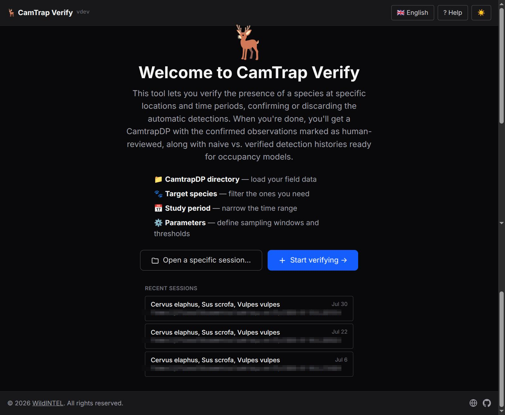
*The Welcome Screen. The exact buttons shown depend on whether a session is currently active and whether you have session history.*

| Button | When it appears | Description |
|---|---|---|
| **Continue previous session →** | Only if a session is currently active | Resumes the session you were last working on. Shows a progress summary below the button (e.g. *3 species · 12/40 occasions reviewed · 30%*). |
| **Open a specific session…** | Always | Opens a file browser so you can load any existing session folder. |
| **Start verifying →** / **New session** | Always — the label depends on state | Starts the Setup Wizard to configure a session. Reads **Start verifying →** if no session is currently active, or **New session** if one is (to start a fresh one alongside it). |

Below the buttons, a **Recent sessions** list appears if you have previously opened sessions on record, letting you jump back into any of them directly — independently of whether a session is active right now.

---

## 5. Setup Wizard

The Setup Wizard guides you through four steps. A step indicator at the top shows your progress.

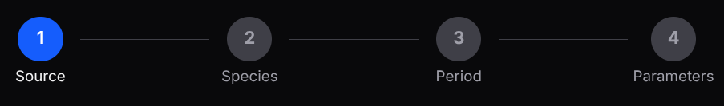
*Step indicator showing the four stages: Source · Species · Period · Parameters.*

You can navigate between steps using the **← Back** and **Next →** buttons, or return to the Welcome Screen with **← Welcome**.

### Step 1 — Source

CamTrap Verify requires you to specify where the information to be verified (images, annotations, deployments, etc.) is located. Although the data is always processed internally in CamtrapDP format, CamTrap Verify supports the following input sources: [CamtrapDP](#option-a--camtrapdp-directory), [DeepFaune](#option-b--deepfaune-csv), [custom CSV](#option-c--custom-csv), and [Trapper](#option-d--trapper-instance).

> **Note:** CamTrap Verify provides a dynamic mechanism for resolving where each image is physically located. This mechanism is based on whether you define an **Images directory**.
>
> If you do indicate it, the resolution procedure is the following: CamTrap Verify first looks for the image at `Images directory/deploymentID/fileName`. If that exact file isn't found and **Search subfolders by file name**{: #search-subfolders-by-file-name } is enabled, it instead searches the whole Images directory recursively for a file with that name (useful when photos are all loose in one folder, as in some TRAPPER downloads). Only if neither of those finds the image does CamTrap Verify fall back to the `filePath` column in `media.csv` itself: absolute paths are used as-is, relative paths are resolved against the Images directory, and remote `http://`/`https://` URLs are fetched directly, through the application's built-in proxy (so no CORS configuration is needed on your end) — but only as a last resort, after the local lookups above have already failed.
>
> If you do not indicate it, there is no separate images root to look in first, so resolution relies entirely on the `filePath` column: absolute paths are used as-is, relative paths are resolved against the CamtrapDP directory itself, and remote URLs are always fetched over the network, since there is nowhere local left to check.

First choose where your data comes from: **Local filesystem** or a **Trapper instance**.

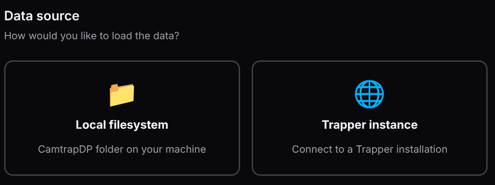
*Data source selector.*

If you select **Local filesystem**, a second selector appears asking for the **data format**. Three formats are supported:

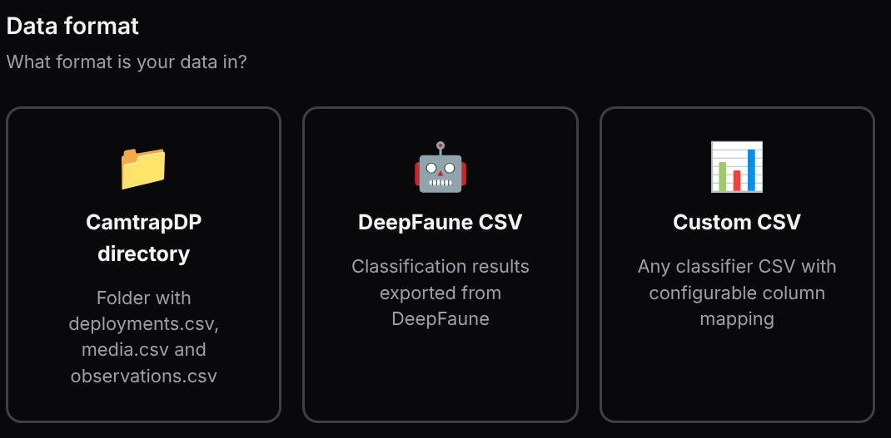
*Format selector: CamtrapDP directory, DeepFaune CSV or Custom CSV.*

#### Option A — CamtrapDP directory

Select the folder on your machine that contains the CamtrapDP files (`deployments.csv`, `media.csv`, `observations.csv`).

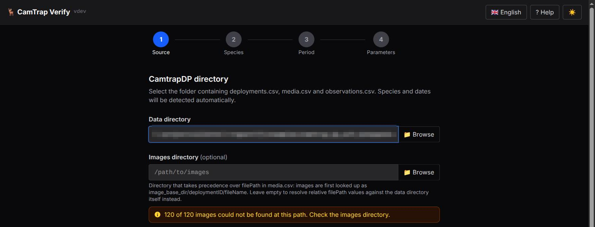
*Local directory selection. The Browse button opens a folder picker.*

- **Data directory** — path to your CamtrapDP folder. Use the **📁 Browse** button or type the path manually.
- **Images directory** *(optional)* — base directory used to resolve relative `filePath` values in `media.csv`. Leave empty to use the data directory itself (default behaviour). Filling it in enables the [**Search subfolders by file name**](#search-subfolders-by-file-name) option (see above).

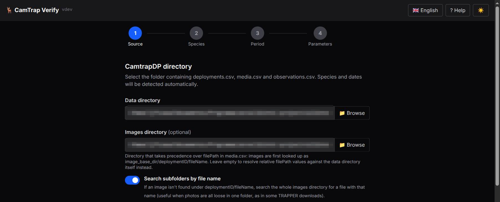
*With an Images directory set, the **Search subfolders by file name** toggle appears.*

After selecting the folder, the application reads species and date ranges automatically. Click **Next →** to proceed.

#### Option B — DeepFaune CSV

If your data comes from [DeepFaune](https://www.deepfaune.cnrs.fr/), select the **DeepFaune CSV** format. The application converts the file to CamtrapDP format automatically. For this reason, the form only asks for a single field, **DeepFaune results file**, where you provide the path to the `.csv` file exported from DeepFaune.

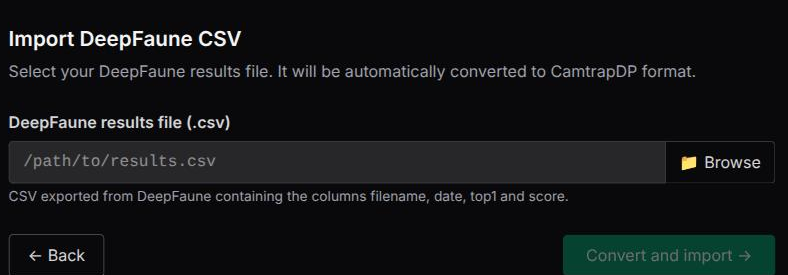
*DeepFaune import form.*

Once you have indicated the path, click **Convert and import →**. Once the conversion is complete, the wizard drops you into the same **Data directory** / **Images directory** screen as Option A above, with **Data directory** already filled in with the converted CamtrapDP folder — fill in **Images directory** there if the paths in your DeepFaune CSV are relative.

#### Option C — Custom CSV

For any other classifier that exports a CSV, choose the **Custom CSV** format. You map the columns of your file to the fields required by CamtrapDP. For this reason, the form first asks for a single field, **CSV file**, where you provide the path to your classifier's `.csv` export.

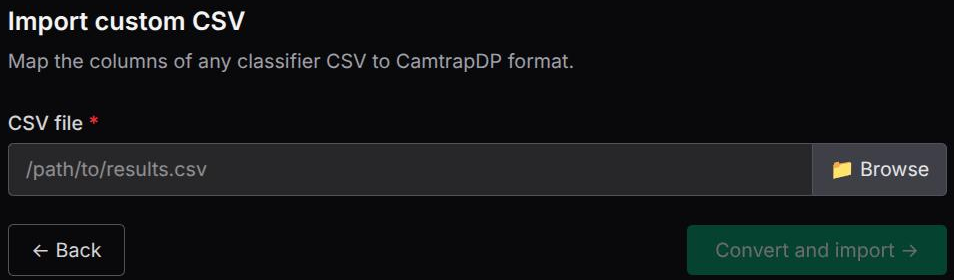
*Custom CSV import form.*

**Column mapping**

Once the CSV file is selected, the application reads its headers and displays a mapping form where you link each column in your file to the fields required by CamtrapDP.

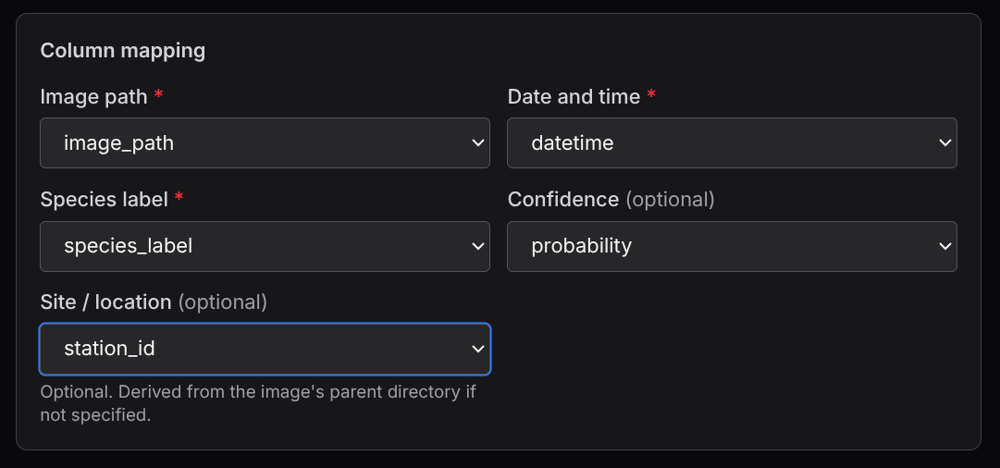
*Column mapping form. Each dropdown is populated with the column names detected in your CSV.*

Select which column in your CSV corresponds to each required field:

| Field | Required | Description |
|---|---|---|
| **Image path** | Yes | Column containing the file path or name of each image. |
| **Date and time** | Yes | Column containing the capture timestamp. |
| **Species label** | Yes | Column containing the classifier's species label. |
| **Confidence** | No | Column containing the detection score (0–1). |
| **Site / location** | No | Column identifying the camera site. Derived from the image path if omitted. |

As soon as you select the **Species label** column, the application reads all unique labels and displays the **Species map** table.

**Species map**

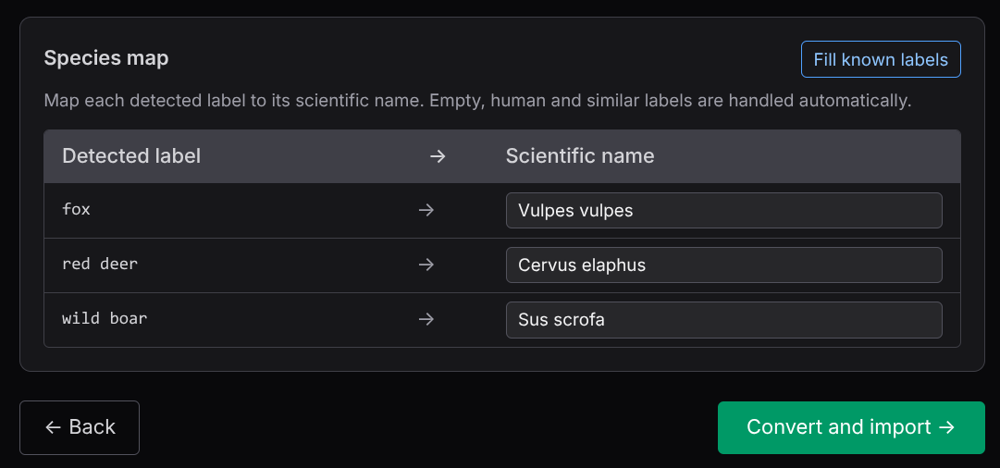
*Species map table. Each detected label must be mapped to a scientific name.*

For each label in your CSV, enter the corresponding scientific name (e.g. `Vulpes vulpes`). Labels that match known DeepFaune classes are pre-filled automatically. Non-animal labels (`empty`, `blank`, `human`, etc.) are handled automatically and do not appear in the table.

Use **Fill known labels** to auto-fill any remaining entries that match the built-in label dictionary.

Once you have mapped the columns and the species, click **Convert and import →**. Once the conversion is complete, the wizard drops you into the same **Data directory** / **Images directory** screen as Option A above, with **Data directory** already filled in with the converted CamtrapDP folder — fill in **Images directory** there if the paths in your CSV are relative.

#### Option D — Trapper instance

Connect to a [Trapper](https://trapper-project.readthedocs.io/) installation to download a CamtrapDP package directly from the platform.

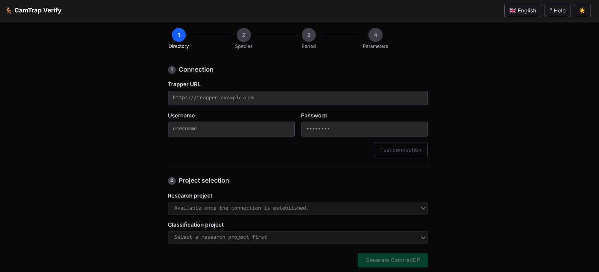
*Trapper connection form.*

1. Enter the **Trapper URL**, **username** and **password**, then click **Test connection**.
2. Once connected, select the **Research project** and the **Classification project**.
3. Click **Generate CamtrapDP** — the package is downloaded and loaded automatically.

> **Note:** Trapper integration is currently under active development. Some features may not yet be available.

### Step 2 — Species

Choose which species you want to verify. The list is populated from the `scientificName` column in `observations.csv`.

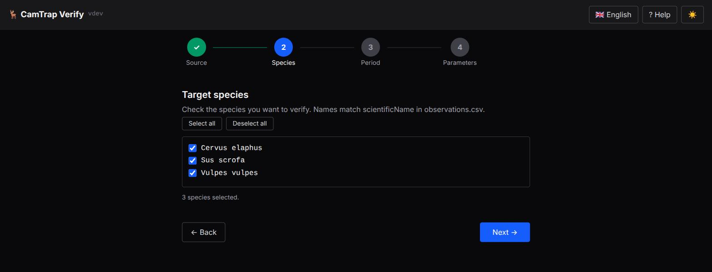
*Species selection step. Check the species you want to review.*

- Use **Select all** / **Deselect all** for bulk actions.
- The counter at the bottom shows how many species are currently selected.

### Step 3 — Study Period

Set the date range for the review. Only images whose timestamp falls within this range will be included.

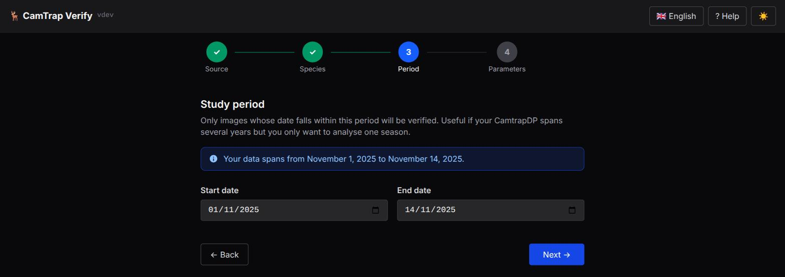
*Study period step. The data range hint shows the earliest and latest dates in your dataset.*

- An info hint shows the full date span available in your data.
- Useful when your CamtrapDP spans multiple years but you only want to analyse one season.

### Step 4 — Parameters

Fine-tune how images are grouped and how confirmations are recorded. Parameters are divided into two sections.

#### Sampling parameters

These control how the data is segmented into reviewable units.

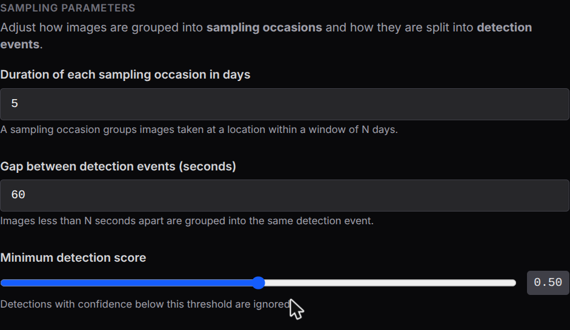
*Sampling parameters section.*

| Parameter | Default | Description |
|---|---|---|
| **Sampling occasion duration (days)** | 5 | Groups images at a location into windows of N days. The number of occasions adapts automatically to the study duration. |
| **Gap between detection events (seconds)** | 60 | Images less than N seconds apart at the same site belong to the same detection event. |
| **Minimum detection score** | 0.5 | Detections below this confidence threshold are excluded from the candidate set. |

#### Confirmation parameters

These control what is recorded in the output when an expert confirms a detection event.

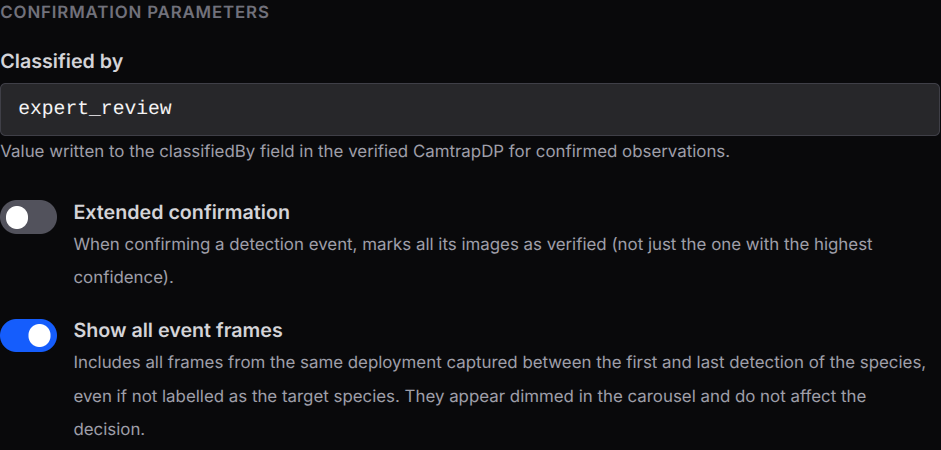
*Confirmation parameters section.*

| Parameter | Default | Description |
|---|---|---|
| **Classified by** | `expert_review` | Value written to the `classifiedBy` field in the verified CamtrapDP for every confirmed observation. Change this to identify the reviewer (e.g. `ornithologist_A`). |
| **Extended confirmation** | Off | When enabled, all observations in the confirmed burst — not just the highest-confidence frame — are marked as human-verified in the output. |
| **Show all event frames** | Off | When enabled, all frames from the same deployment captured between the first and last detection of the target species are shown in the carousel, even if they are not labelled as that species. This lets you see the full context of the animal's visit. Context frames appear dimmed and do not affect the decision. |

Click **✓ Start verification** to process the data and begin the review.

---

## 6. Species Index

After setup (or when resuming a session), you arrive at the **Species Index** — an overview of all target species and their review progress.

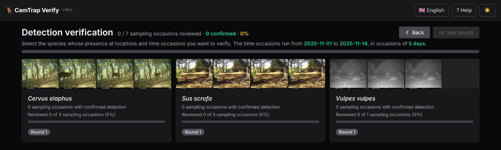
*Species index showing species cards with progress bars.*

An information panel at the top shows the session parameters:

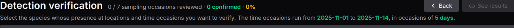
*Info panel showing overall progress, the study period and the sampling occasion length.*

- **Overall progress** — how many sampling occasions have been reviewed out of the total, how many are confirmed, and the percentage complete.
- **Study period and sampling occasion length** — the date range being reviewed and the N-day window each sampling occasion spans.
- **← Back** — return to the Welcome Screen.
- **See results** — navigate to the Results page (only active when all species are complete).

Each **species card** displays:

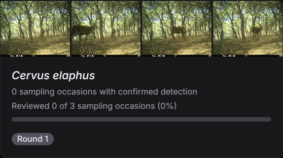
*A species card showing thumbnail strip, progress bar and round badge.*

- A thumbnail strip with representative images.
- The number of sampling occasions with confirmed detections.
- A progress bar and percentage of reviewed occasions.
- A badge: **Complete** (green) or **Round N** (grey) indicating the current review round.

Click any card to open the Image Gallery for that species.

---

## 7. Image Gallery

The Image Gallery is the main review screen. It shows all sampling occasions for a single species, grouped by location.

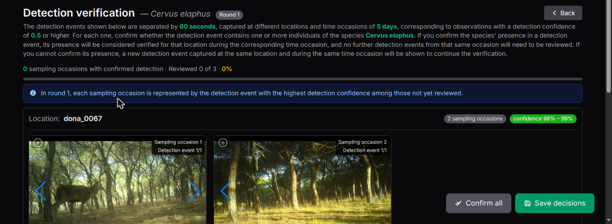
*Gallery showing sampling occasion cards grouped by site.*

The header shows:
- The species name and current round badge.
- Overall progress (occasions reviewed / total).
- A **← Back** button to return to the Species Index.

A blue info box below the header explains the round logic:

> *In round N, each sampling occasion is represented by the detection event with the highest detection confidence among those not yet reviewed.*

### Reviewing Detection Events

Each **sampling occasion card** shows:

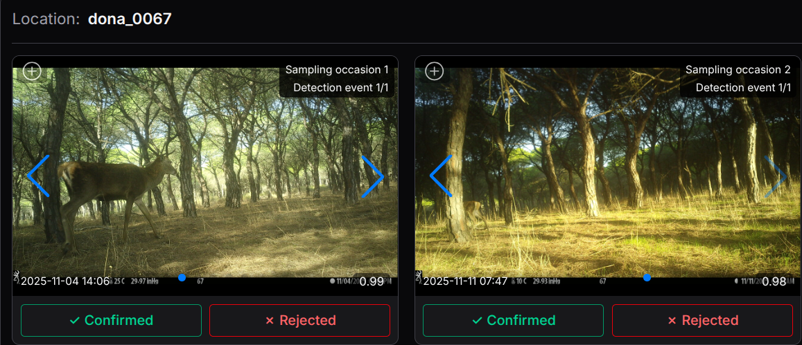
*A sampling occasion card with image carousel and decision buttons.*

- Location and occasion number.
- Confidence range of the detection events in this occasion.
- A carousel of the images in the current detection event, with left/right arrows to browse frames.
- Two decision buttons: **✓ Confirmed** and **✗ Rejected**.

If **Show all event frames** is enabled, all frames from the same deployment captured between the first and last detection of the target species are shown in the carousel, including those not labelled as that species. These frames appear dimmed and do not affect the decision.

Click any image to open the [Fullscreen Lightbox](#fullscreen-lightbox).

### Fullscreen Lightbox

Click any image thumbnail to open the lightbox for a closer look.

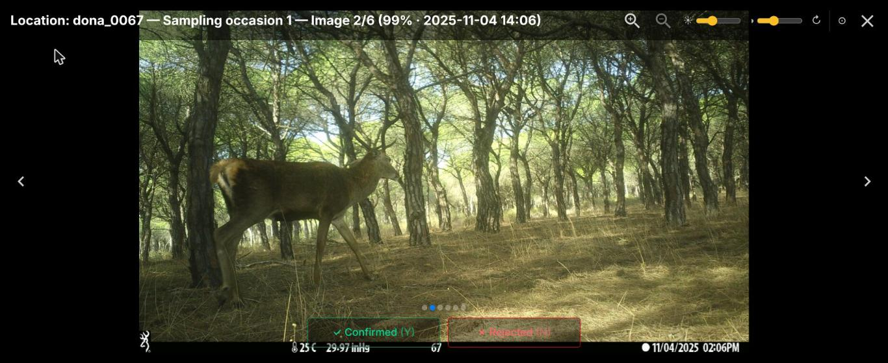
*Fullscreen lightbox with image controls and decision buttons.*

The lightbox shows:
- The full-size image with zoom and pan support.
- Navigation arrows to browse frames within the detection event.
- The location and sampling occasion in the title bar.
- Decision buttons and image adjustment controls in the toolbar.

### Image Controls

The lightbox toolbar provides several controls to improve image visibility:

| Control | Description |
|---|---|
| ☀ **Brightness** | Slider to increase or decrease brightness (50 – 200 %). |
| ◑ **Contrast** | Slider to increase or decrease contrast (50 – 200 %). |
| ↻ **Rotate 90°** | Rotate the image clockwise in 90° steps. |
| ⊘ **Reset image** | Restore brightness, contrast and rotation to defaults. |
| **Invert colours** | Toggle colour inversion — useful for night-vision images. |

All adjustments reset automatically when you move to a different detection event or close the lightbox.

### Keyboard Shortcuts

While the lightbox is open:

| Key | Action |
|---|---|
| `Y` | Confirm the current detection event |
| `N` | Reject the current detection event |
| `←` `→` | Navigate between frames in the detection event |

After a decision, the lightbox automatically advances to the next undecided detection event.

### Saving Decisions

Once you have reviewed the detection events, click **💾 Save decisions** (floating button, bottom-right).

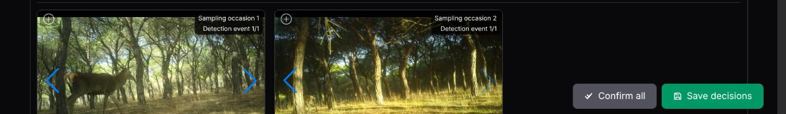
*Floating action buttons: Confirm all, Save decisions.*

- If all detection events have been decided, the session advances to the next round (if any occasions were rejected) or marks the species as **Complete**.
- If some detection events are still undecided, a warning is shown.

The **✓✓ Confirm all** button marks every undecided detection event in the current view as confirmed in one click.

### Completed Species

When all occasions for a species have been decided, the gallery shows a **Complete** badge and locks the view.

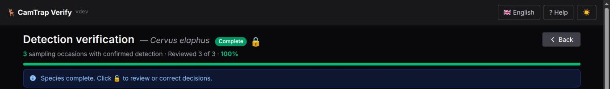
*Completed species with the lock icon and edit mode toggle.*

- Click 🔓 to enter **edit mode** and correct any decisions.
- In edit mode, click **Update decisions** to save and regenerate the results.
- Click 🔒 to lock the view again.

---

## 8. Results

Once all species are complete, the **See results** button in the Species Index header becomes active.

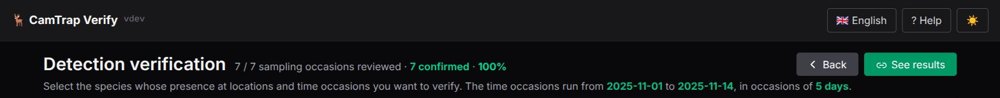
*The "See results" button turns green when all species have been reviewed.*

Click it to open the **Results** page, which summarises the entire review.

The page first shows the **output directory**:

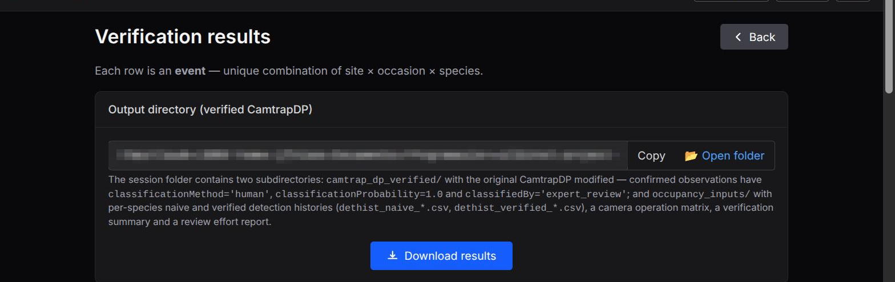
*Output directory, with copy/open-folder buttons and the Download results button.*

This is the path to the generated files (see [Output Files](#output-files) below for what's inside), with a copy button, a shortcut to open the folder, and a **Download results** button to get a `.zip` of the whole session folder. If the exported package's `datapackage.json` had to be auto-generated (the source had none), a warning is shown here listing which fields are placeholders rather than derived from your data.

Next comes the **review breakdown**:

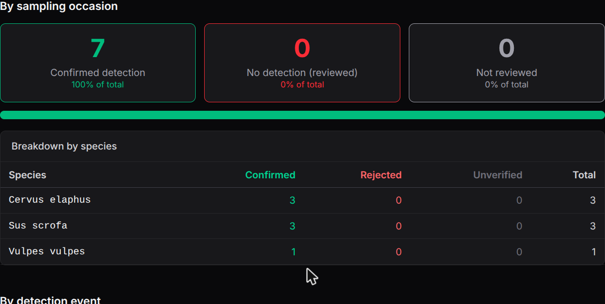
*"By sampling occasion" breakdown, with overall counts and a per-species table.*

This is repeated twice — **by sampling occasion** and **by detection event** — each with confirmed / rejected / unreviewed counts and percentages, followed by a per-species breakdown table.

Finally, when enough detection history is available, the page shows an **occupancy estimate**:

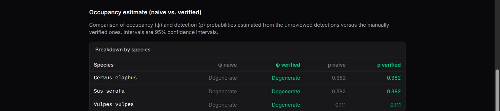
*Naive AI-only occupancy (ψ) and detection (p) probabilities compared against the manually verified ones, per species, with 95% confidence intervals.*

### Output Files

Each session is saved in a timestamped subfolder inside the output directory (e.g. `~/Documents/camtrap_verify/20260629_143021/`). The folder contains:

**Session files (root)**

| File | Description |
|---|---|
| `config.json` | Session configuration: data directory, date range, parameters. |
| `candidate_manifest.csv` | Full list of candidate detection events generated at setup. |
| `rejected_media.json` | IDs of media files rejected during the review. |
| `decisions/` | Per-species per-round decision CSVs, named `decisions_{species}_iter{N}.csv` (e.g. `decisions_Vulpes_vulpes_iter1.csv`). |

**`camtrap_dp_verified/`** — verified CamtrapDP package

| File | Description |
|---|---|
| `deployments.csv` | Original deployment table (unchanged). |
| `media.csv` | Original media table (unchanged). |
| `observations.csv` | Confirmed observations updated with `classificationMethod='human'`, `classificationProbability=1.0`, `classifiedBy=<configured value>` and `classificationTimestamp`. |

**`occupancy_inputs/`** — ready-to-use files for occupancy models

| File | Description |
|---|---|
| `camera_operation.csv` | Camera operation matrix (sites × sampling occasions). |
| `dethist_naive_{sp}.csv` | Naive detection history per species (AI detections, not human-validated). One file per species. |
| `dethist_verified_{sp}.csv` | Verified detection history per species (confirmed by expert). One file per species. |
| `verification_summary.csv` | Per-species summary: confirmed, rejected and unreviewed counts. |
| `review_effort.csv` | Total review effort: number of detection events and images inspected. |
